# Indices {.unnumbered}

```{r packages}
#| include: false
library(tidyverse)
library(yaml)
library(xml2)
library(gt)
source("script/utils.R")
options(readr.show_col_types = FALSE)

params <- read_yaml("data/config.yml")
```


## Scribes

```{r index of scribes}
#| echo: false
#| output: asis
#| warning: false

get_scribe <- function(mei) {
  read_xml(mei) %>% 
    as_list() %>%
    pluck("mei", "meiHead", "manifestationList") %>% 
    map(\(m) { # for each manifestation …
      map(
        m$itemList,  # … and each item …
        \(i) tibble(  # … get siglum, shelfmark, scribe(s)
          siglum = pluck(i$physLoc$repository$identifier, 1),
          shelfmark = i$physLoc$identifier[[1]],
          scribe = map_chr(i$physDesc$handList, 1)
        )
      ) %>% 
        list_rbind()
    }) %>% 
    list_rbind() %>% 
    mutate(
      id = path_file(mei) %>% path_ext_remove()
    )
}

# get_scribe("data/works_mei/B_1.xml")
scribes <-
  dir_ls("data/works_mei") %>% 
  map(get_scribe) %>% 
  list_rbind()

scribes %>% 
  mutate(group = str_sub(id, 1, 1)) %>% 
  left_join(
    read_csv("data/catalogue_overview.csv") %>% distinct(group, file),
    by = "group"
  ) %>% 
  mutate(
    id = str_replace_all(id, "_", "."),
    id = str_glue("[{id}](/groups/{file}.html#work-{id})")
  ) %>% 
  select(scribe, siglum, shelfmark, id) %>% 
  arrange(
    scribe,
    siglum,
    str_rank(shelfmark, numeric = TRUE)
  ) %>% 
  gt(groupname_col = "scribe") %>%
  fmt_markdown(columns = id) %>%
  cols_label(id = params$catalogue_prefix) %>% 
  tab_options(
    column_labels.font.weight = "bold",
    row_group.background.color = "grey90",
    table_body.hlines.style = "none"
  )
```


### Notes and writing samples

#### František Ignác Antonín Tůma

:::{#fig-scribes-tuma}
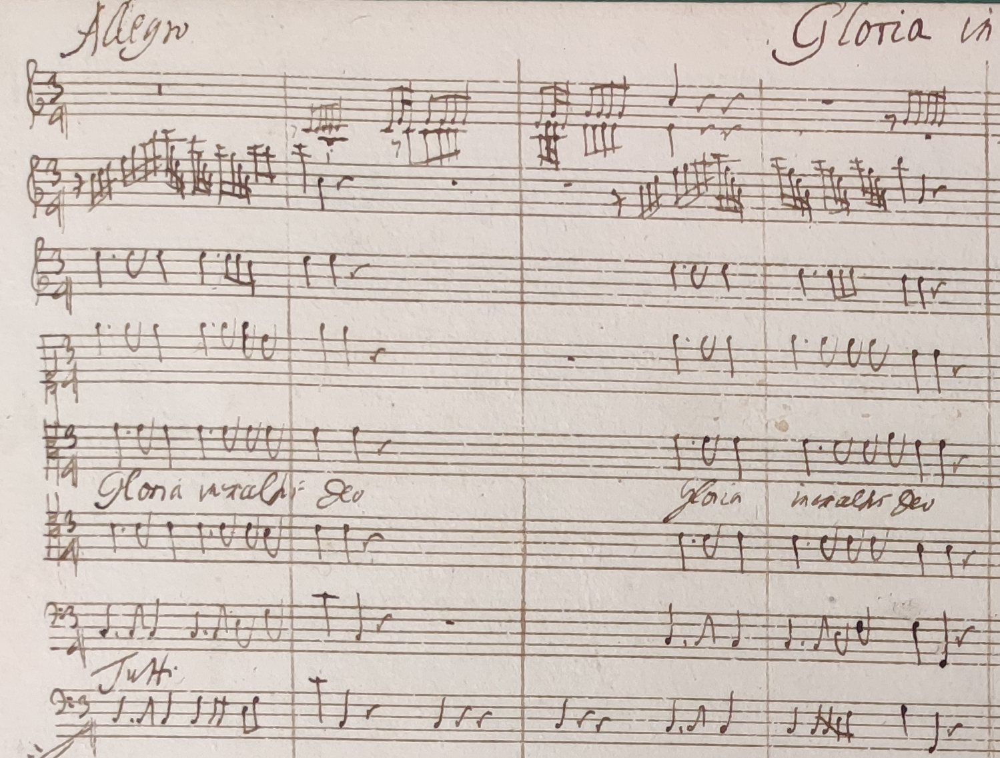

Messa All’Onor’è Preggio del Gran’ Patriarcha San Benedetto, TumW A.22 (A-Ws E 3/26)
:::


#### Anton Ristl

:::{#fig-scribes-ristl layout-ncol=3}
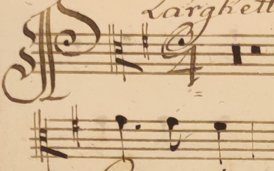

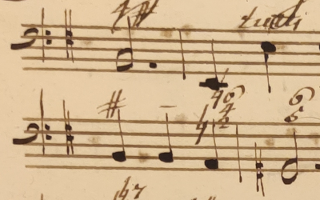

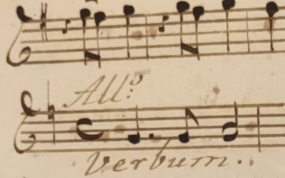

Pange lingua, TumW C.2.1 (A-Wn Mus.Hs.15686)
:::


#### Joseph Leysser

The hands of Leysser and Ristl are highly similar [@Eybl1996]. However, they can be distinguished by the bass clef [@Prominczel2024] and the dating of the sources (Ristl mainly worked in 1741/42, while Leysser was active throughout the 1740s).

:::{#fig-scribes-leysser layout-ncol=3}
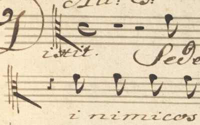

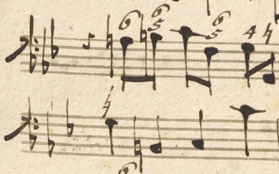

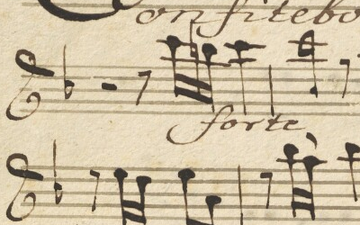

Vesperae de Confessore, TumW D.1.4 (A-Wn Mus.Hs.15726)
:::


#### Copyist E

This scribe was likely involved in the rapid creation of the initial performance material for Empress Elisabeth Christine's chapel in 1741. However, their manuscripts are also found in the Schottenstift archive, e.g., in the parts for Missa tibi solo, TumW A.25 (A-Ws E 3/21).

:::{#fig-scribes-copyist-e layout-ncol=3}
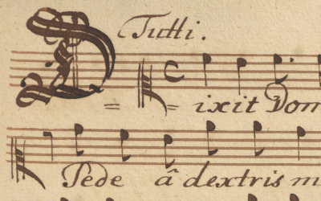

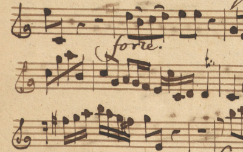

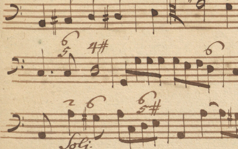

Dixit Dominus, TumW D.2.8 (A-Wn Mus.Hs.15680)
:::


#### P. Maurus Brunnmayr

Brunnmayr (1689–1747) was *Regens chori* in the Göttweig abbey in 1726–28 and again in 1739–47. He collected at least 600 works of his contemporaries [@Lashofer1983, p. 210, 452].

:::{#fig-scribes-maurus layout-ncol=3}
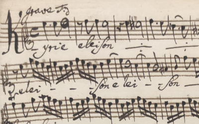

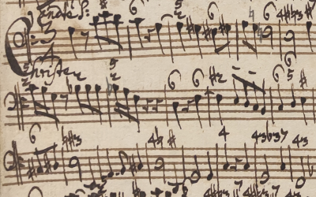

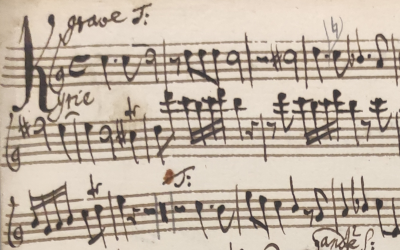

Messa All’Onor’è Preggio, TumW A.22 (A-GÖ 629)
:::


#### P. Joseph Unterberger

Unterberger (1731–1788) was *Regens chori* in the Göttweig abbey in 1754–69. He copied hundreds of works, including early works of the Haydn brothers [@Lashofer1983, p. 235, 452].

:::{#fig-scribes-maurus layout-ncol=3}
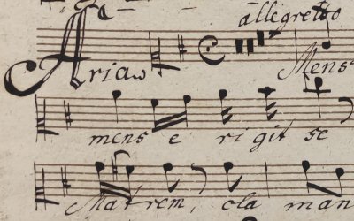

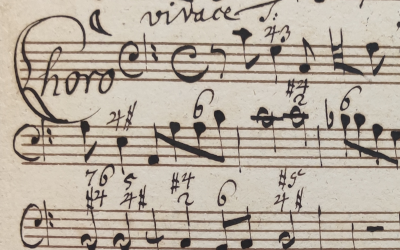

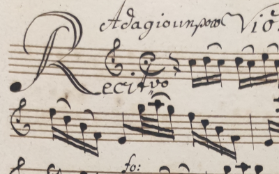

Succurre Regina, TumW C.3.3 (A-GÖ 1636)
:::


#### P. Marian Prazner

Prazner (1746–1818) was *Regens chori* in the Göttweig abbey in 1774–1813. He composed sacred music, copied foreign works, and collected printed music [@Lashofer1983, p. 246f, 452].

:::{#fig-scribes-maurus layout-ncol=3}
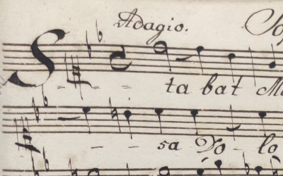

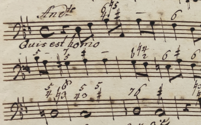

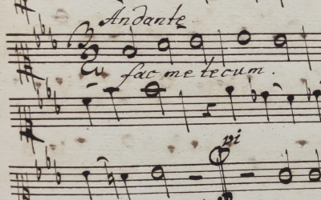

Stabat mater, TumW F.2 (A-GÖ 1786)
:::


#### Copyist Ottobeuren 1

:::{#fig-scribes-copyist-ottobeuren-1 layout-ncol=3}
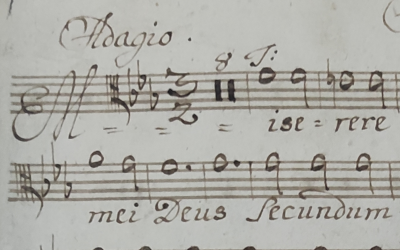

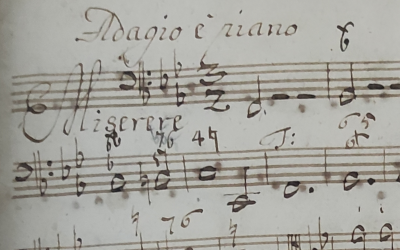

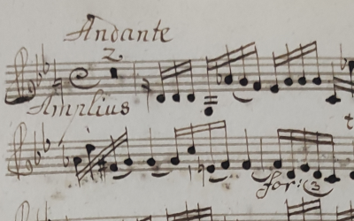

Misere, TumW D.3.7 (D-OB MO 807)
:::


## Works by library

```{r index of works by library}
#| echo: false
#| output: asis
#| warning: false

read_rds("data_generated/works.rds") %>% 
  left_join(
    read_csv("data/catalogue_overview.csv") %>% distinct(group, file),
    by = "group"
  ) %>% 
  unite(group:number, col = "id", sep = ".", na.rm = TRUE) %>%
  unnest(sources, names_sep = "_") %>% 
  separate_wider_delim(
    sources_source,
    delim = " ",
    names = c("siglum", "shelfmark"),
    too_many = "merge"
  ) %>%
  select(id, siglum, shelfmark, file) %>%
  mutate(
    link = str_glue('<a href="/groups/{file}.html#work-{id}">{id}</a>')
  ) %>% 
  select(!c(file, id)) %>% 
  summarise(
    .by = c(siglum, shelfmark),
    link = str_flatten(link, ", ")
  ) %>% 
  arrange(siglum, str_rank(shelfmark, numeric = TRUE)) %>%
  gt(groupname_col = "siglum") %>%
  cols_label(link = params$catalogue_prefix) %>% 
  fmt_markdown(columns = link) %>%
  tab_options(
    column_labels.font.weight = "bold",
    row_group.background.color = "grey90",
    table_body.hlines.style = "none"
  )
```
